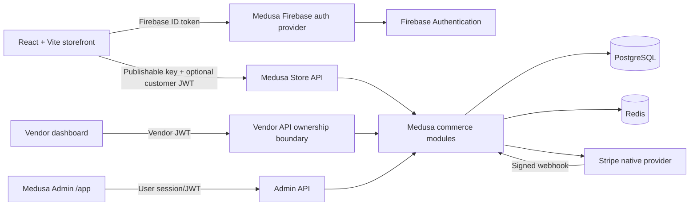
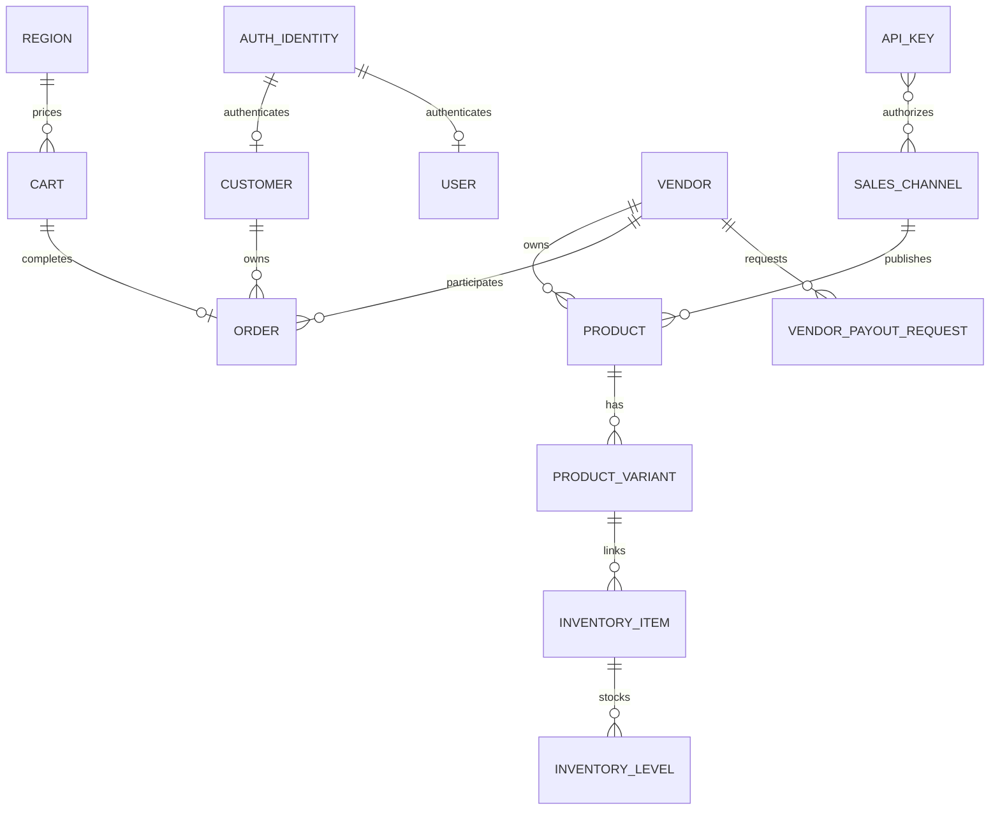
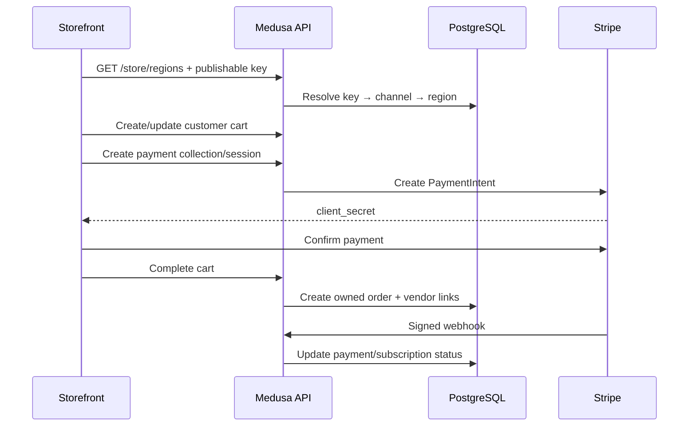
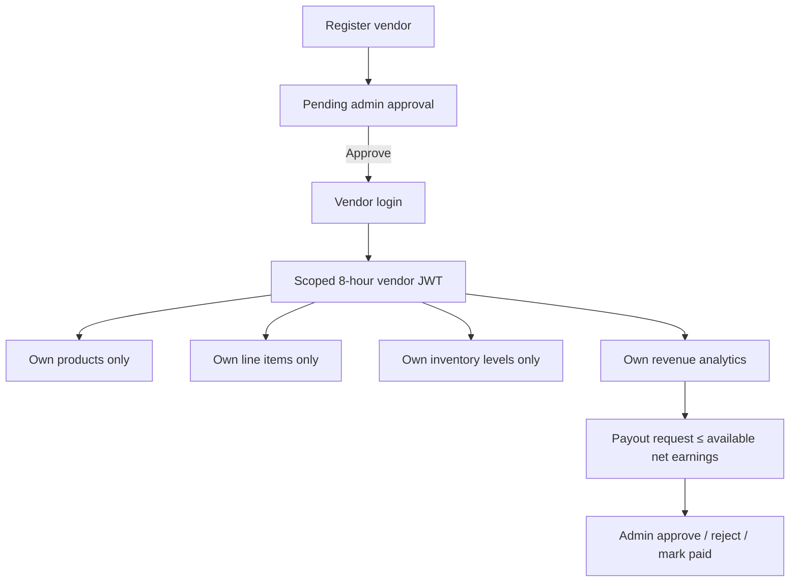
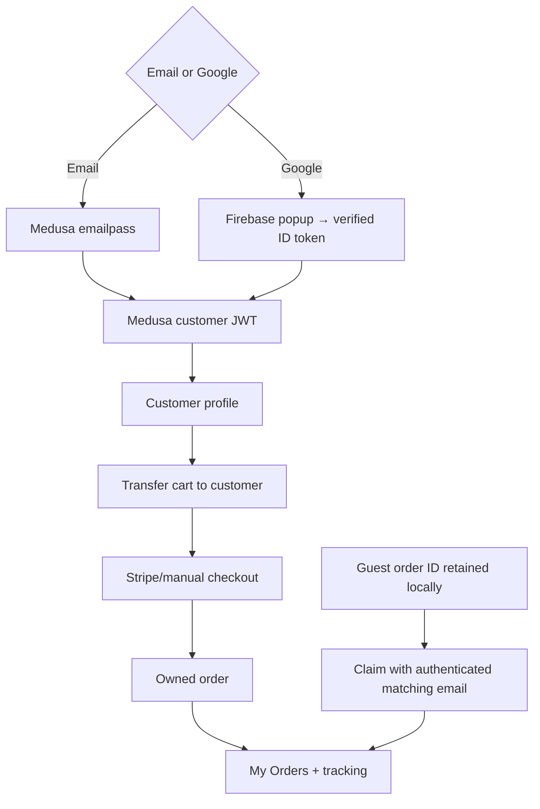

# Organic Canada Production Audit

Audit date: 2026-06-21  
Canonical application: `backend/` + `frontend/`

## Executive result

Both production builds pass, frontend lint passes with no errors, all 11 auth tests pass, the Medusa server starts on port 9000, Store API returns one Canadian region and four published products, and Stripe plus manual payment providers are active for the region. Vendor, customer, and admin boundaries return `401` without the correct token.

The recovered PostgreSQL database contained no orders or vendors. During migration validation, the tracked vendor module snapshot generated and executed a destructive migration that dropped core module tables. Before that validation the database held 2 customers, 1 admin user, and 4 products; it held no orders or vendors. The migration was rolled back, but PostgreSQL rollback recreated the schema without those rows. The unsafe snapshots were removed, the payout migration was replaced with a hand-scoped migration, the schema was repaired, the 4-product catalog was reseeded, and admin users were reprovisioned. No database backup was present from which to restore the 2 customer rows. Never generate or execute a migration without a database backup and SQL review.

## Issue-by-issue report

| # | Root cause / why it broke | Files and exact repair | Why the fix works | Migration / environment |
|---|---|---|---|---|
| 1 Customer login | Global middleware returned health JSON for mounted nested routes; Axios errors were spread and lost `response`; `401` was retried; Firebase sync registered after any error; registration was not recoverable; forgot-password was a fake toast. | `backend/src/api/middlewares.ts`: removed root interception. `frontend/src/services/apiClient.js`: preserve Axios error, 15s timeout, transient GET retry. `authService.js`: normalized email, idempotent two-step registration, password reset endpoint, one canonical token. `firebaseAuthService.js`: coalesced requests and deterministic retry policy. `Login.jsx`: invokes reset API. | Real auth responses now reach the client; invalid credentials are not amplified; partial identity/profile registration recovers safely. | Password-reset delivery still requires a Medusa notification/email provider. |
| 2 Admin login | Recovery utility directly wrote bcrypt hashes although installed Medusa emailpass uses scrypt, did not reliably link an auth identity to a `user`, and treated Medusa's optional `--` separator as the command. The storefront also exposed customer-protected pseudo-admin pages. | `backend/src/scripts/admin-users.ts`: normalizes both CLI forms, validates credentials, uses `authService.register/updateProvider`, and links with `createUserAccountWorkflow`. `middlewares.ts`: all `/admin/*` custom APIs require a Medusa `user`. `frontend/src/routes/Approutes.jsx`: removed pseudo-admin routes; use Medusa Admin at `/app`. | Password format matches the installed provider, the JWT has a real `user_id` actor, and both argument forms work. Live admin login returned HTTP 200 with a JWT. | Admin utility accepts passwords of 8+ characters with upper/lowercase, number, and special character. |
| 3 Regions | Health middleware intercepted `/store/regions`; SDK and Axios used separate request paths; recovered region/key IDs became stale. | `frontend/src/lib/medusa/regions.js`: single Axios path and in-flight request cache. Database reseeded with Canada/CAD; storefront `.env` IDs refreshed; publishable key linked to sales channel. | Region calls now return actual Store API data and StrictMode cannot duplicate resolution. | `VITE_MEDUSA_REGION_ID`, `VITE_MEDUSA_PUBLISHABLE_KEY`. |
| 4 Product visibility | Same interception masked product results; vendor-created products lacked sales-channel assignment and used hard-coded USD. | `vendor/products/route.ts`: requires active region/channel, publishes immediately, links channel, prices in region currency. Database has 4 published products, 20 variants, 20 inventory levels, 4 active channel links. | Store API can price and expose products immediately in the active channel. | No new core migration. |
| 5 Orders | Checkout posted `customer_id` to generic cart update instead of Medusa's transfer endpoint. Guest claim trusted email alone. Subscriber returned before vendor linkage for ordinary orders. | `checkoutService.js`: `POST /store/carts/:id/customer`. `Checkout.jsx` + claim route: guest order IDs are retained and email+ID possession is required. `order-placed.ts`: vendor linking runs for non-subscription orders. | Logged-in carts produce owned orders; guest claims are constrained; vendor links are created for all orders. | Live DB had 0 historical orders, so runtime list behavior was verified structurally only. |
| 6 Vendor dashboard | Password hashing used 1,000 PBKDF2 rounds and fallback JWT secret; products and inventory were not fully scoped; no payout ledger. | `vendor/auth.ts`: bcrypt cost 12, constant-time legacy verification/upgrade, strict secret, issuer/audience, 8h token. Vendor routes enforce ownership. Added `/vendor/inventory`, `/vendor/payouts`, inventory and earnings pages, admin payout review APIs, and payout model. | A vendor token can access only linked products/items/orders/levels; committed payouts reduce available net earnings. | `Migration20260620120949.ts` creates only `vendor_payout_request`; applied successfully. |
| 7 Stripe | Stripe was not linked to the active region; webhook accepted unsigned production events; provider could load with missing key. | `medusa-config.ts`: conditional provider and production env checks. `webhooks/stripe/route.ts`: production signature required. Region linked to `pp_stripe_stripe`; live provider endpoint returns Stripe + manual. | Checkout can initialize native Stripe sessions and forged production webhook payloads are rejected. | `STRIPE_API_KEY`, `STRIPE_WEBHOOK_SECRET`, `VITE_STRIPE_PUBLISHABLE_KEY`. Configure Stripe to call the Medusa-native webhook and the custom subscription webhook if subscriptions are used. |
| 8 Firebase | Firebase UID was used as a password; concurrent sync created duplicate requests; persistence/logout were incomplete. | Added `backend/src/modules/firebase-auth` using official `firebase-admin` ID-token verification. Frontend sends ID token, persists Firebase locally, coalesces sync, and signs both systems out with `allSettled`. Firebase browser config is env-overridable. | The server validates issuer/signature/audience/expiry instead of trusting a public UID. | `FIREBASE_PROJECT_ID`; recommended `FIREBASE_CLIENT_EMAIL`, `FIREBASE_PRIVATE_KEY` for revocation checks. Browser `VITE_FIREBASE_*` variables. |
| 9 Stability | Redis omitted; payment modules loaded with placeholders; environment validation was bypassed by build; duplicate process launches caused port errors. | `medusa-config.ts`: Redis URL wired, optional providers conditional, production required variables. Added `/health`. Server startup verified. | Production fails early on missing critical configuration and optional modules no longer crash startup. | `REDIS_URL` is mandatory in production. EADDRINUSE means another instance owns port 9000; stop that managed process or choose a port—never auto-kill arbitrary processes. |
| 10 API audit | Root middleware intercepted every mounted API; public seed/order mutation routes existed; custom admin routes lacked global auth; request logs included bodies. | Removed `store/seed-now`, `store/test-update-order`, `store/customers/native`, root route, and storefront pseudo-admin routes. Added admin auth, vendor auth, auth rate limits, sanitized structured logs, and dedicated health route. | Public clients cannot seed catalog, rewrite ownership, or call admin mutations. Logs no longer contain passwords/addresses/cart bodies. | None. |
| 11 Database | Custom-module snapshots contained the whole Medusa schema and generated `DROP TABLE` statements. Link tables retained orphan rows after recovery. | Removed application-wide `.snapshot-medusa-backend.json` files from custom modules; replaced the generated migration with a hand-scoped migration; repaired module migration history; reseeded Canada catalog; removed orphan publishable-key/product/region links. | Future custom-module migrations cannot treat core Medusa tables as module-owned; active relations now point to existing rows. | Always take a PostgreSQL backup and review generated SQL before `db:migrate`. |
| 12 Frontend | StrictMode exposed duplicate region/auth requests; two HTTP clients diverged; broken legacy `medusa` reference; customer state transitions triggered lint failures. | Promise caches, single region client, retry boundaries, fixed legacy SDK reference, corrected subscription declaration order, updated tests. | Requests are deterministic and current code builds/lints cleanly. | None. |
| 13 Environment | Firebase config was embedded, Stripe/Redis variables incomplete, stale DB IDs remained in Vite env. | Expanded both env templates; runtime variables validated; local public region/key refreshed. | Production configuration is explicit and secret variables remain server-only. | See deployment checklist. |
| 14 Production readiness | CSP allowed `*`, unsafe eval/inline; CORS reflected fallback origins; no timeout/rate limit; unsafe logs and fake forgot password. | Strict security headers, exact CORS allowlist, auth throttling, API timeout/retry, existing ErrorBoundary/skeleton/toasts retained, input validation added to vendor/auth/inventory/payout APIs. | Reduces credential stuffing, data leakage, hanging UI, invalid writes, and browser injection surface. | For multi-instance deployments replace per-process auth limiting with Redis/gateway rate limiting. |

## Fixed architecture

## Database diagram

## API flow

## Vendor flow

## Customer flow

## Deployment checklist

- [x] Admin users provisioned and `/auth/user/emailpass` verified; rotate temporary/test passwords before production.
- [ ] Set unique 32+ character `JWT_SECRET` and `COOKIE_SECRET`.
- [ ] Set `DATABASE_URL`; take a tested backup before every migration.
- [ ] Set production `REDIS_URL` and deploy Redis-backed cache/event/workflow infrastructure.
- [ ] Set exact HTTPS `STORE_CORS`, `ADMIN_CORS`, and `AUTH_CORS` origins—no wildcard.
- [ ] Set `MEDUSA_BACKEND_URL` to the public HTTPS API.
- [ ] Configure `STRIPE_API_KEY`, `STRIPE_WEBHOOK_SECRET`, and the browser publishable key; send a signed test webhook.
- [ ] Configure Firebase server credentials for revoked-token checks and add production domains in Firebase Console.
- [ ] Configure a notification/email provider and password-reset subscriber/template.
- [ ] Run `npm run build` in backend and frontend, `npm test`, and `npm run lint -- --quiet`.
- [ ] Run `npx medusa db:migrate --skip-links` only after reviewing migration SQL; run link sync separately with backup.
- [ ] Smoke test region, catalog, registration/login/logout/reset, cart ownership, Stripe payment, order history, vendor isolation, refund, and payout review.
- [ ] Put Medusa behind a reverse proxy/WAF with request-size limits and distributed rate limiting.
- [ ] Enable centralized structured logs, error monitoring, database backups, Stripe webhook alerts, and uptime checks on `/health`.

## Final bug report

Fixed: global API interception; emailpass retry loop; Axios error corruption; duplicate Firebase sync; insecure UID password bridge; partial customer registration; fake reset action; unlinked cart customer; insecure guest claim; missing ordinary-order vendor links; weak vendor password hashing; fallback JWT secret; vendor sales-channel/currency omission; missing inventory and payout paths; unsigned production Stripe webhooks; missing Stripe-region link; public destructive routes; unprotected custom admin routes; sensitive body logging; permissive CSP/CORS; stale storefront key/region; unsafe vendor migration snapshot.

Verified: backend build; frontend build; lint with zero errors; 11 auth tests; server startup; `/health`; region Store API; products Store API; customer invalid login `401`; Firebase invalid token `401`; vendor unauthenticated `401`; admin unauthenticated `401`; Stripe and manual region providers; schema/table/link counts.

## Remaining risks

1. Migration validation lost the 2 recovered customer rows described above; there were no order/vendor rows. No usable database backup was present. Validate and back up any external production database independently before running these migrations.
2. Password-reset email delivery needs a production notification provider; the API request itself is wired.
3. Refund behavior depends on Medusa Admin/Stripe live-mode configuration and must be tested with a real refundable test charge.
4. Firebase revoked-token checks require server service-account credentials; without them signature/issuer/audience/expiry are still checked, but explicit revocation is not.
5. Rate limiting is per process. Use Redis or a gateway/WAF for horizontally scaled production.
6. Payout calculation currently uses gross non-canceled order line items and a fixed 10% commission. Tax, refund, return, chargeback, shipping allocation, and jurisdiction-specific settlement rules need a finalized marketplace accounting policy before real payouts.
